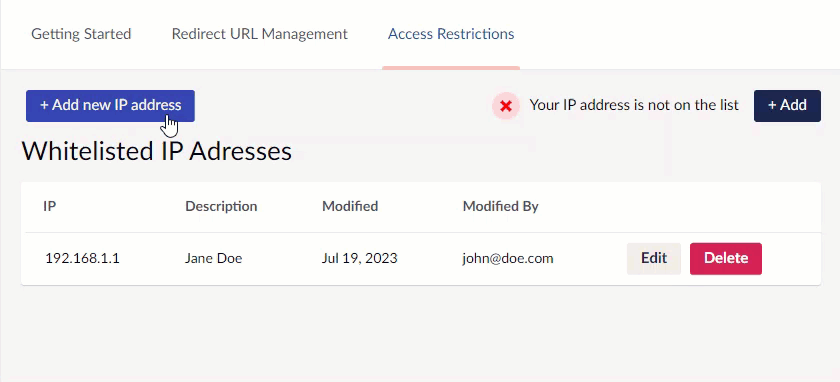
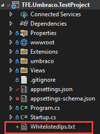

# TFE.Umbraco.AccessRestriction

[](LICENSE.md)
[](https://www.nuget.org/packages/TFE.Umbraco.AccessRestriction)
[](https://www.nuget.org/packages/TFE.Umbraco.AccessRestriction)

**TFE.Umbraco.AccessRestriction** is a IP access restriction manager for Umbraco. The package features a dashboard and editor that let's users manage whitelisted IP addresses from within the Umbraco backoffice. IP's can be added with a description and have both a creation and modified date and user.

## Getting started

|License:|Umbraco:|Target Framework:|
|--------|--------|-----------------|
|[MIT License](./LICENSE.md "MIT License")|Umbraco 13|.NET 8|

## Package Installation

The Umbraco 13 version of this package is only available via [NuGet](https://www.nuget.org/packages/TFE.Umbraco.AccessRestriction). To install the package, you can use either .NET CLI:

```C#
dotnet add package TFE.Umbraco.AccessRestriction --version 13.3.2
```

or the older NuGet Package Manager:

```C#
NuGet\Install-Package TFE.Umbraco.AccessRestriction --version 13.3.2
```

## Umbraco Installation

Before the Umbraco middleware, add the IPAccessRestrictionMiddleware to Program.cs or Startup.cs in previous versions:

```C#
app.UseMiddleware<IPAccessRestrictionMiddleware>(); 
```

Add the necessary usings to Program.cs (or Startup.cs):

```C#
using TFE.Umbraco.AccessRestriction.Middleware;
```

Add these settings to appsettings.json

```C#
"TFE.Umbraco.AccessRestriction": {
    "disable": true, 
    "logBlockedIP": false,
    "localHost": "127.0.0.1", 
    "excludePaths": "/umbraco, /App_Plugins, /api/keepalive/ping",
    "includePaths": "", 
    "isCloudFlare": false,
    "customHeader": ""
  }
```

Either use "excludePaths" or "includePaths" to direct the IP blocker.

### Azure / CloudFlare  / Umbraco Cloud Installation

When installed on a cloud environment make sure to add your the cloud IP Addresses. 
Replace the following excludePaths property in appsettings.json :

```C#
"excludePaths": "/umbraco, /App_Plugins, /api/keepalive/ping, /umbraco-signin-oidc, /sb", 
```

Set to true when using Cloudflare

```C#
"isCloudFlare": true,
```

If a proxy is being used, set the value of the 'customHeader' field to 'header' with the IP address used by the proxy.

```C#
"customHeader": "",
```

## Whitelist IP Addresses

There are two different ways to whitelist an IP address, though the dashboard interface and by adding the IP address to WhitelistedIps.txt. Both methods can be used simultaneously and separately.

### Add an IP using the Umbraco dashboard



### Add an IP using WhitelistedIps.txt

Add WhitelistedIps.txt to the root of your Umbraco project.



IP Addresses must be line separated and to add a comment use the #.

```C#
192.168.1.1 
192.168.1.2 #John
192.168.1.3
::1 
192.168.1.4 #Hank  
```

## Features

- Global dashboard for listing all whitelisted IP addresses.
- Package handles IP addresses added manually by a user with admin rights and IP addresses added to the WhitelistedIps.txt.
- logBlockedIP enables you to see all blocked IP addresses in the Umbraco log.
- Use *as wildcard to add a range of IP addresses e.g. "192.168.1.*"
- Include or exclude paths from being blocked.

## Contribution guidelines

To raise a new bug, create an issue on the GitHub repository. To fix a bug or add new features, fork the repository and send a pull request with your changes. Feel free to add ideas to the repository's issues list if you would like to discuss anything related to the library.

### Who do I talk to?

This project is maintained by Rutger Dijkstra and contributors. If you have any questions about the project please raise a issue on GitHub.
